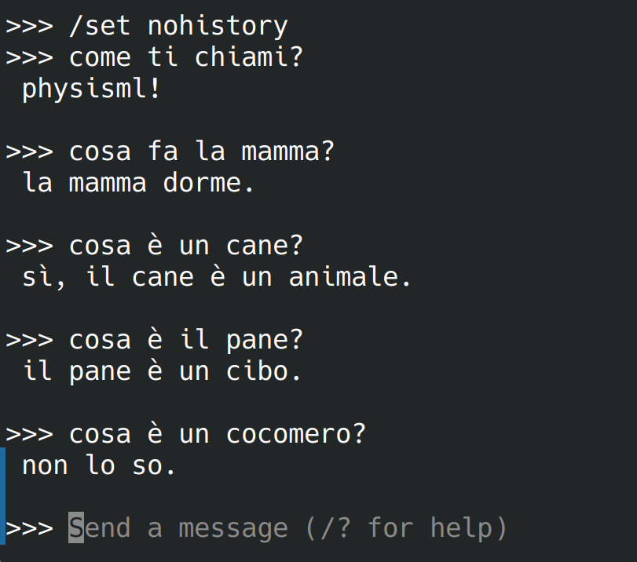

# PhysisML

[](https://doi.org/10.5281/zenodo.22285422)
[](https://github.com/speleoalex/PhysisML/actions/workflows/tests.yml)

*Leggi in: [English](README.md)*

Un piccolo LLM costruito da zero, ispirato all'apprendimento biologico.
Il modello impara come un bambino — prima i suoni, poi le parole, poi le frasi —
guidato da un tutor che adatta il curriculum in tempo reale.

- **Curriculum progressivo**: da fonemi a letteratura e appartenenza a classi (italiano livelli 0–12, inglese 0–5)
- **Sistema affettivo innato**: `confidence`, `pleasure`, `pain`, `fear` modulano i logits durante l'inference
- **Segnale insegnante**: un insegnante locale gratuito (o, opzionalmente, un tutor Claude) genera esempi mirati sui deficit correnti del modello
- **Dimensioni minime**: transformer GPT-2 style, ~23.6M parametri, si addestra su CPU o GPU consumer



I pesi pubblicati in `ollama`, dopo
[`scripts/export_gguf.py`](scripts/export_gguf.py) — con `/set nohistory`, così
ogni risposta sta in piedi da sola senza contesto di conversazione. L'ultima è
il senso del progetto: `cocomero` è un nome che il modello non ha mai visto, e
dirlo è una cosa che gli è stata insegnata.

---

## Provalo in due minuti

I pesi addestrati sono pubblicati sull'Hub di Hugging Face. Non serve
addestrare niente per sentir parlare il modello:

```bash
# --depth 1 non è un dettaglio: i corpus del curriculum sono versionati nel
# repository perché i risultati siano riproducibili, e la storia completa pesa
# circa 400 MB.
git clone --depth 1 https://github.com/speleoalex/PhysisML.git
cd PhysisML
pip install -r requirements.txt

python3 standalone/chat.py "di: cosa mangia il cane?"
```

Il primo avvio scarica ~95 MB da
[`speleoalex/physisml-it-preview`](https://huggingface.co/speleoalex/physisml-it-preview)
in `models/hf/` e risponde — in tutto 74 secondi su un portatile senza GPU,
download compreso:

```
il cane mangia il pane.
```

Senza argomenti parte una REPL. Trascrizione letterale, greedy, sui pesi
pubblicati:

```
========================================================
  PhysisML — interactive generation
========================================================
  params     : 23,589,376
  vocab      : 2593 active / 9000 total
  d_model    : 512  n_heads=8  n_layers=6
  context    : 128 tokens
  temperature: 0.0  (0 = greedy)
  affect     : on
========================================================

>>> cos è il cane?
<<< il cane è un animale.

>>> il pane è buono?
<<< secondo me il pane è buono perché è caldo.

>>> cos è un falco?
<<< non lo so.
```

L'ultima risposta è il punto del progetto: `falco` è un nome che al modello non
è mai stato insegnato, e il livello 12 gli insegna a dirlo invece di inventare.
È un modello piccolo con un vocabolario piccolo, e fuori dal terreno su cui è
stato istruito produrrà assurdità; [le FAQ](docs/it/faq.md) dicono senza giri
di parole che cosa questo dimostra e che cosa no.

Su una macchina senza GPU, aggiungi l'indice CPU di PyTorch all'installazione
per scaricare un wheel da ~200 MB invece di quello CUDA da ~2 GB:

```bash
pip install -r requirements.txt --extra-index-url https://download.pytorch.org/whl/cpu
```

Per addestrarne uno da zero, vedi [Avvio rapido](#avvio-rapido) più sotto.

---

**Documentazione**

| Documento | IT | EN |
|---|---|---|
| **FAQ — le cinque obiezioni** | [docs/it/faq.md](docs/it/faq.md) | [docs/en/faq.md](docs/en/faq.md) |
| Progetto tecnico e filosofico | [docs/it/modello_PhysisML.md](docs/it/modello_PhysisML.md) | [docs/en/physisml_model.md](docs/en/physisml_model.md) |
| Contesto sui modelli linguistici classici | [docs/it/modelli_linguistici_classici.md](docs/it/modelli_linguistici_classici.md) | [docs/en/classic_language_models.md](docs/en/classic_language_models.md) |
| Setup di sviluppo | [docs/it/setup/development.md](docs/it/setup/development.md) | [docs/en/setup/development.md](docs/en/setup/development.md) |
| Setup GPU Intel Arc | [docs/it/setup/gpu_intel_arc.md](docs/it/setup/gpu_intel_arc.md) | [docs/en/setup/gpu_intel_arc.md](docs/en/setup/gpu_intel_arc.md) |
| Come contribuire | — | [CONTRIBUTING.md](CONTRIBUTING.md) |

---

## Risultati

Exact match contro le risposte gold del curriculum, greedy
(`scripts/measure_repetition.py`), build del 2026-09-01. Il set di target è
cresciuto con questo rebuild — i livelli 11-12 ora insegnano la relazione
dell'onestà su 38 nomi in ogni formulazione, 1369 prompt contro gli 849
precedenti — quindi due numeri, ognuno onesto su cosa confronta:

| | |
|---|---|
| **probe congelato, 104 prompt identici — build precedente vs questa** | 84.6% → **90.4%** |
| questo checkpoint su tutti i target attuali (1369 prompt) | 84%, auto-ripetizione 2% |

| | L0 | L1 | L2 | L3 | L4 | L5 | L6 | L7 | L8 | L9 | L10 | L11 | L12 |
|---|----|----|----|----|----|----|----|----|----|----|-----|-----|-----|
| tutti i livelli, un solo modello | 100% | 97% | 79% | 87% | 93% | 97% | 80% | 91% | 95% | 75% | 97% | 92% | 57% |

Il 57% di L12 è sul suo pool triplicato e più duro (chiedere del referente
giusto con un distrattore nel prompt, sì/no valutato sulla parola di polarità —
che nessun valutatore controllava prima di questo build).

La leva è il **sogno** — un ripasso del materiale di ogni livello, senza nuovo
insegnamento. Misurato al livello 6, un ciclo ha portato la media sui sette
livelli visti da 23.7% a **84.3%**. I sogni non si contano più con una
costante: dopo ognuno il probe congelato viene rimisurato e il livello smette
di sognare quando il guadagno marginale muore
(`scripts/dream_until_plateau.py`). Misurato su questo build, il ginocchio di
L11 era a 8 sogni — il vecchio `MIN_DREAMS=6` lo avrebbe fermato a 76.9%
invece di 82.7% sul probe — e L12 ha toccato il massimo al sogno 9 di una
curva a dente di sega. La curva di ogni livello è registrata nella sua
cartella checkpoint come `dream_curve.json`.

### Inglese (livelli 0-5)

Un secondo curriculum, costruito da zero il 2026-09-05 con vocabolario proprio,
assiomi propri e nessun peso in comune col modello italiano. È mezza scala: si
ferma al livello 5, quindi non ha niente di quello che insegnano i livelli
11-12 — la relazione is-a, l'ammissione di ignoranza, la domanda.

| | L0 | L1 | L2 | L3 | L4 | L5 |
|---|----|----|----|----|----|----|
| tutti i livelli, un modello | 100% | 100% | 75% | 100% | 67% | 100% |

Media 90.3% (65 prompt su 72). Sul probe congelato di 48 prompt: **85.4%**,
auto-ripetizione 4.2%. Build completo in 5h53 su GPU Intel Arc
(21/41/69/47/71/96 minuti per livello).

```
what is the cat like?          -> the cat is small.
what does the dog eat?         -> the dog eats bread.
why does the dog eat?          -> the dog eats because it is hungry.
what will the dog do tomorrow? -> tomorrow the dog will eat bread.
```

Il sogno del livello 5 si è fermato sul tetto (`MAX_DREAMS=12`), non su un
plateau: la curva saliva ancora, dal 60% all'85%, quando il cap l'ha
interrotta. La scheda di questi pesi è
[huggingface/README.en.md](huggingface/README.en.md); sono pubblicati su
[`speleoalex/physisml-en-preview`](https://huggingface.co/speleoalex/physisml-en-preview)
e `python3 standalone/chat.py --lang en "say: the cat"` li scarica e li esegue.

### Il sogno è solo replay? Il controllo EWC (exp_i)

Il sogno è experience replay — la domanda onesta è se un metodo
anti-oblio standard della letteratura faccia lo stesso lavoro senza portarsi
dietro il corpus. Il benchmark `exp_i` risponde: stessa rete, stesso
curriculum, stesso harness, livelli 0→6, due semi, tre bracci — `dream` (il
meccanismo del progetto), `ewc` (EWC online, Schwarz et al. 2018: Fisher
running `F ← γ·F_prev + F_new`, γ=0.95, ancora rinnovata a ogni confine di
livello, λ=1000 da uno sweep preliminare), `none` (il pavimento, λ=0). I
bracci ewc/none tengono ogni canale di consolidamento del livello corrente e
perdono solo il replay cross-livello; sei sogni per livello, fissi, in tutti
i bracci.

| braccio | ritenzione (checkpoint finale su tutti i livelli) | apprendimento (ogni livello sul proprio checkpoint) |
|---|---|---|
| dream | **64.4%** (65.0 / 63.9) | 80.7% (82.5 / 79.0) |
| ewc | 13.0% (13.6 / 12.5) | 37.1% (35.0 / 39.2) |
| none | 22.0% (20.1 / 23.9) | 77.9% (76.4 / 79.4) |

*(media tra i semi, poi seme 1 / seme 2; rumore run-to-run: 2.2 punti)*

Tre verdetti, ognuno replicato su entrambi i semi:

- **Il replay vale +42.5 punti** di ritenzione rispetto a nessuna protezione.
  Il braccio `none` atterra a ~20% — lo stesso numero dei build pre-sogno,
  che fa anche da controllo di validità interna dell'harness.
- **EWC finisce 9 punti *sotto* il non fare niente**, e costa ~44 punti di
  apprendimento *corrente*. Il dettaglio per livello è eloquente: `none`
  dimentica i livelli di mezzo ma tiene L0 e l'appena-imparato L6 a ~100%;
  `ewc` perde anche quelli (L6 al 10–20%).
- λ non è il problema: nello sweep la ritenzione sale monotona con λ
  (33→41% per λ=100→10000) senza mai avvicinare il braccio replay, mentre
  l'apprendimento corrente scende.

**Perché EWC collassa qui** — riportato come sequenza di diagnosi
falsificate, perché il processo di eliminazione è l'argomento:

1. *Accumulo del Fisher sulle ancore dei livelli?* Morta: l'accumulo γ
   spiega al massimo un fattore ~2.9×; la massa di Fisher misurata cresce
   di ~70×.
2. *Una spirale a feedback dallo stimare il Fisher su un livello non
   convergente?* Morta: le loss di fine livello sulle stesse coppie usate
   per la stima sono ≈0 (0.0001–0.06) anche nel braccio collassato;
   Spearman ρ = −0.14 tra loss finale e massa nuova di Fisher.
3. *Quella che sopravvive:* a loss ≈ 0 il Fisher empirico `E[g²]` è la
   **varianza del gradiente tra esempi**, non curvatura. Con la loss SFT
   prompt-masked e risposte brevi, quella varianza si concentra sui token
   che ogni esempio condivide: 20 righe di embedding su 2.590 portano
   l'89–93% della massa — lo spazio da solo il 32–43%, poi ':', articoli,
   '!' — più un altro 27–32% sul primo blocco di attention. L'ancora è
   **anti-selettiva**: congela la macchina che produce *qualsiasi*
   risposta, non il sapere dei livelli passati. Replicato su entrambi i
   semi — stessa concentrazione, stessi token in testa, massa assoluta ~3×
   diversa: il danno segue la concentrazione, non la scala.

Il claim che questo sostiene è deliberatamente stretto: **in questo
curriculum a memorizzazione quasi-perfetta per livello, la nostra
implementazione dell'EWC online standard con Fisher diagonale empirico
resta nettamente sotto l'experience replay — sia in ritenzione che in
apprendimento corrente — e persino sotto il baseline non regolarizzato; il
replay lo paga portandosi dietro il corpus invece delle statistiche.** Non
è "EWC è sbagliato in generale": normalizzare il Fisher per token, o
escludere i token strutturali, sarebbe un altro algoritmo (la famiglia
Riemannian Walk, Chaudhry et al. 2018), e il confronto non è
compute-matched — l'N1 del sogno rigioca fino a 7 livelli per ciclo contro
l'unico del braccio ewc — quindi l'*efficienza* relativa dei due metodi
resta una questione aperta (un braccio compute-matched è annotato come
lavoro futuro), anche se il budget non può spiegare ewc che finisce sotto
`none`. Riproducibile con
`MODE=sweep|main ./scripts/experiment_ewc.sh --confirm`; le matrici di
ritenzione per braccio finiscono in `models/exp_i/`.

## Requisiti

```bash
pip install -r requirements.txt

# Macchina senza GPU: un wheel da ~200 MB invece di quello CUDA da ~2 GB
pip install -r requirements.txt --extra-index-url https://download.pytorch.org/whl/cpu
```

Quattro pacchetti: `numpy` e `torch` per addestrare, `huggingface_hub` e
`safetensors` per scaricare e caricare i pesi pubblicati. `requirements-dev.txt`
aggiunge pytest; `requirements-optional.txt` elenca quello che chiedono i
singoli script, protetto da un try/except al punto di import — il tutor Claude,
il costruttore di corpus, l'esportatore GGUF.

**Per addestrare il curriculum italiano non serve nessuna chiave API**: tutti i
livelli 0-12 hanno il loro `local_teacher.json`, quindi `./build.sh` insegna
con il tutor offline.

### Tutor disponibili

| `--tutor-model` | Chi valuta le risposte | Richiede |
|---|---|---|
| `local` | regole deterministiche | niente |
| `hybrid` | prompt locali + un LLM locale piccolo | [llama.cpp](https://github.com/ggml-org/llama.cpp) o [ollama](https://ollama.com) attivo |
| `claude-haiku-4-5`, `claude-sonnet-4-6` | API Claude | `pip install anthropic` + chiave API |
| `auto` *(default)* | `hybrid` → `local` se il livello ha `local_teacher.json`, altrimenti Claude | — |

`build.sh` usa `local` per L0-L1 e `hybrid` da L2 in su quando un LLM locale
risponde, quindi un run italiano completo non costa nulla. Il valutatore gira su
**llama.cpp o ollama**, quello che è attivo — se ci sono entrambi vince
`llama-server` di llama.cpp (un solo modello già residente, nessuna latenza di
caricamento) — e può stare anche su un'altra macchina:

```bash
LLAMA_SERVER_BASE=http://gpu-box:8080 ./build.sh 4     # llama.cpp
OLLAMA_BASE=http://gpu-box:11434 PHYSISML_LLM_MODEL=qwen3:8b ./build.sh 4
```

Con ollama la mappa livello → modello è un requisito: un modello non installato
disabilita il valutatore LLM invece di sostituirlo con un altro. Con llama.cpp il
server ospita un modello solo, e quello è quello che si usa.

Il tutor Claude resta l'insegnante migliore ai livelli alti, ed è l'unico
disponibile per il curriculum inglese (`training_files/en/` non ha ancora un
`local_teacher.json`). È opzionale e si abilita così:

```bash
pip install anthropic python-dotenv
echo "ANTHROPIC_API_KEY=sk-ant-..." > .env
```

> I pesi addestrati **non** sono nel repository (`models/`, `*.pt` sono in `.gitignore`).
> Costruisci un modello da zero con `./build.sh`.

---

## Avvio rapido

```bash
# Addestra i livelli 0→1 in automatico (fase testuale + insegnamento, senza chiave API)
./build.sh 1

# Parla col modello
python3 dynamic_model/run.py                       # interattivo
python3 dynamic_model/run.py "testo" 2>/dev/null   # risposta singola
```

### Sequenza manuale per un livello

```bash
# Phase 0: training testuale su training_files/it/0/
python3 dynamic_model/train_curriculum.py --phase 0 --level 0 --epochs-0 10 --lang it

# Phase 1: insegnamento col tutor (ripetibile)
./teach.sh 100        # 100 turni fissi
./teach.sh auto       # continua finché la qualità è raggiunta (Ctrl-C sicuro)

# Attiva e testa il checkpoint
./set_model.sh models/checkpoints/it/level_0/final_learned.pt
python3 dynamic_model/run.py "mamma" 2>/dev/null
```

Stessa sequenza per i livelli successivi: `--level 1`, `--level 2`, …
Ogni livello parte dal `final_learned.pt` del livello precedente.

---

## Comandi principali

| Comando | Scopo |
|---------|-------|
| `./build.sh N [modello] [auto] [--resume]` | Addestramento automatico livelli 0→N |
| `./build.sh N --lang en` | Lo stesso, sul curriculum di un'altra lingua (anche `PHYSISML_LANG`). Tutti gli script qui sotto accettano `--lang` |
| `MIN_DREAMS=6 ./build.sh N` | Pavimento di sogni per livello (default 6, `0` disattiva). Sopra il pavimento il conteggio è misurato: si sogna finché il probe congelato guadagna (`MAX_DREAMS`, `DREAM_EPSILON`, `DREAM_PATIENCE`) |
| `./teach.sh [turni\|auto] [local\|hybrid\|haiku\|…] [lingua] [livello]` | Sessione di insegnamento |
| `./set_model.sh <checkpoint>` | Imposta il modello attivo (`models/active.pt`) |
| `./reset.sh [--lang L\|all] [--dry-run]` | Backup + reset del modello. Senza `--lang` sparisce solo la lingua di default |
| `python3 dynamic_model/train_curriculum.py` | Training testuale e/o insegnamento (vedi `--help`) |
| `python3 dynamic_model/test_model.py --level N` | Statistiche di qualità del modello corrente |
| `python3 scripts/measure_repetition.py --ckpt-base models/checkpoints/it --levels 0-12` | Exact match **e** tasso di ripetizione, in greedy |
| `python3 scripts/retention_matrix.py --levels 0-12` | Matrice di ritenzione: ogni checkpoint su ogni livello |
| `ANTI_FORGETTING=dream\|ewc\|none ./build.sh N` | Braccio anti-oblio: `ewc` = EWC online (`EWC_LAMBDA`, `EWC_GAMMA`) con sidecar Fisher per livello (`scripts/compute_fisher.py`); `none` = nessun canale cross-livello |
| `MODE=sweep\|main ./scripts/experiment_ewc.sh --confirm` | Il benchmark sogno-vs-EWC (exp_i): sweep λ su L0-L2, poi 3 bracci × 2 semi su L0-L6 |
| `python3 dynamic_model/run.py` | Sessione interattiva |
| `python3 scripts/download_wikipedia.py --level N` | Scarica articoli Wikipedia per il training |
| `python3 scripts/generate_qa_corpus.py --levels 0 1 2` | Genera corpus dialogico dalle coppie QA |
| `python3 scripts/generate_qa_corpus.py --check --levels 0 1 2` | Verifica che ogni `qa_corpus.txt` corrisponda al suo `qa_pairs.jsonl` (esce 1 se stantio) |
| `python3 scripts/export_gguf.py` | Esporta un checkpoint in GGUF, poi `ollama create physisml -f Modelfile` |
| `python3 scripts/export_hf.py [--lang en] [--out DIR]` | Prepara la cartella per Hugging Face (safetensors + model card + codice di inferenza). Scheda e cartella seguono la lingua |
| `./scripts/build_status.sh` | Dove è arrivato un build: livello, sessione, qualità, cosa sta girando |
| `python3 scripts/curiosity_rate.py --gate off` | Ammette di non sapere sui nomi ignoti e non su quelli noti |

Flag principali di `train_curriculum.py`: `--phase 0|1`, `--level N`, `--lang it|en`,
`--epochs-0 N`, `--interactions N|auto`, `--age 0-7+` (età virtuale → stile di
insegnamento), `--tutor-model auto|local|hybrid|haiku|sonnet`.

**Insegnanti disponibili**: `local_teacher.py` (deterministico, gratuito,
offline), `hybrid_teacher.py` (prompt locali + valutazione con LLM locale via
llama.cpp o ollama, gratuito e con GPU), tutor Claude via API (opzionale — vedi [Tutor disponibili](#tutor-disponibili)).

---

## Struttura del progetto

```
PhysisML/
├── training_files/{it,en}/N/   ← corpus testuale per lingua e livello
│   ├── *.txt                   ← testi di training (qa_corpus.txt = coppie dialogiche)
│   └── teacher_prompt.md       ← stile insegnante per livello (opzionale)
├── models/                     ← checkpoint (in .gitignore)
│   ├── active.pt               ← copia per test, mai modificata dal training
│   └── checkpoints/{lang}/level_N/{final.pt, final_learned.pt}
├── dynamic_model/              ← codice di training, insegnamento, inference
├── scripts/                    ← strumenti corpus, export GGUF, analisi
├── standalone/                 ← chat autoconsistente (modello + tokenizer + REPL)
│   └── webui/                  ← FastAPI + chat web con feedback/training (README dedicato)
├── docs/it/                    ← documentazione approfondita
└── build.sh / teach.sh / reset.sh / set_model.sh
```

Per ogni livello ci sono due checkpoint: `final.pt` (solo training testuale) e
`final_learned.pt` (conoscenza appresa nell'insegnamento, aggiornato ad ogni sessione).

---

## Corpus del curriculum

| Lingua | Livello | Contenuto |
|--------|---------|-----------|
| it | 0 | Suoni e sillabe (scritto a mano) |
| it | 1 | Parole singole, famiglia, filastrocche |
| it | 2 | Articolo + sostantivo, frasi base |
| it | 3 | Frasi soggetto+verbo, identità, numeri e colori |
| it | 4 | Soggetto+verbo+oggetto, sequenze prima/poi |
| it | 5 | Connettivi (e / ma / perché), aggettivi |
| it | 6 | Passato prossimo, cause, due frasi collegate |
| it | 7 | Futuro, contrasto fra i tempi, dialogo breve |
| it | 8 | Comparativi, preferenze motivate, descrizioni |
| it | 9 | Tesi + motivo + conclusione, sinonimi |
| it | 10 | Commento motivato, confronto, citazione |
| it | 11 | Classi e relazione is-a (il gatto è un animale) |
| it | 12 | Chiedere quando il nome è ignoto |
| en | 0–1 | Suoni e grammatica base (scritto a mano) |
| en | 2 | Shakespeare |
| en | 3 | Alice in Wonderland + Oliver Twist |
| en | 4 | Jane Eyre + Pride & Prejudice |
| en | 5 | Moby Dick |

**Riproducibilità del corpus.** `qa_pairs.jsonl` è la fonte (coppie
prompt→risposta estratte dalle sessioni) ed è tracciato; `qa_corpus.txt` è
derivato — le coppie ripetute 20 volte in ordine mescolato — ed è tracciato
anch'esso perché un clone deve poter addestrare senza passaggi intermedi. La
generazione usa un RNG dedicato con seed fisso, quindi lo stesso
`qa_pairs.jsonl` produce sempre lo stesso corpus su qualunque macchina.
`--check` verifica che i due siano allineati.

Ogni livello ha un `local_teacher.json` (pool chiuso di obiettivi, deterministico),
un testo curato coerente col livello e un `qa_corpus.txt` generato dalle sessioni
(coppie prompt→risposta). I testi narrativi lunghi restano nel repository, in
`training_files/it/N/_reference/`, ma **non entrano in nessuna fase**: né
training testuale, né insegnamento, né replay del sogno, né costruzione del
tokenizer. Prosa per adulti cancella le associazioni prompt→risposta appena
costruite, e l'italiano arcaico non è la lingua del curriculum. Il meccanismo
è la posizione: tutti i caricatori usano un glob `*.txt` non ricorsivo sulla
cartella del livello. Dettagli in
[training_files/it/_reference_README.md](training_files/it/_reference_README.md).

---

## Lingue

Una lingua è una cartella, mai un ramo nel codice. `training_files/<lang>/`
contiene il corpus e le configurazioni dei tutor, `models/checkpoints/<lang>/`
i pesi, e tutti gli script accettano `--lang` (o `PHYSISML_LANG`): due build non
si sovrascrivono mai a vicenda.

```bash
./build.sh 5 --lang en                          # costruisce il curriculum inglese
./teach.sh 100 local --lang en --level 3        # una sessione di insegnamento
./reset.sh --lang en                            # azzera SOLO checkpoints/en/
python3 dynamic_model/test_model.py --level 5 --lang en
python3 scripts/train_tokenizer.py --lang en --vocab-size 3000
python3 scripts/export_hf.py --lang en --out hf_en
python3 standalone/chat.py --lang en "say: the cat"  # i pesi pubblicati
```

`dynamic_model/run.py` non vuole nessun flag di lingua: riconosce il
vocabolario del checkpoint e scrive quello che ha trovato prima della prima
risposta (`Language: en  (English)  [from the vocabulary]`).

### Il manifesto

Quasi tutto quello che serve a una lingua segue le convenzioni del repository e
si ricava dal solo codice della lingua:

| artefatto | convenzione |
|---|---|
| vocabolario | `dynamic_model/data/tokenizer_<lang>.json` |
| probe congelato | `dynamic_model/data/probe_set_<lang>.json` |
| scheda del modello | `huggingface/README.<lang>.md` |
| cartella di export | `hf_upload_<lang>` |

(L'italiano tiene i nomi storici — `tokenizer_8k.json`, `probe_set.json`,
`huggingface/README.md`, `hf_upload/` — perché ogni checkpoint pubblicato e ogni
revisione sull'Hub è stata fatta contro quelli.)

Quello che resta non è derivabile da un codice di lingua, perché sono *parole*.
Sta in `training_files/<lang>/language.json`, e ogni chiave è opzionale:

| chiave | cosa decide |
|---|---|
| `axioms` | le parole le cui righe di embedding il training protegge, con la loro protezione. Devono essere token interi del vocabolario di **questa** lingua: sul vocabolario inglese l'assioma italiano `mamma` si codifica in `m\|am\|ma` e congela tre sottoparole arbitrarie |
| `stop_words` | le parole funzione, per tutto ciò che separa il contenuto dalla grammatica |
| `polarity` | come questa lingua dice sì e no, perché il grader distingua una risposta chiusa giusta dal suo contrario |
| `teacher_fallback` | il prompt del tutor usato quando un livello non ha `teacher_prompt.md`, una banda per ogni età virtuale |
| `hf_repo` | il repo Hub su cui questa lingua pubblica. Nessuna convenzione, di proposito: indovinare un nome di repo e farci un push non si annulla |
| `name` | il nome leggibile, solo per l'output a schermo |

Una lingua che omette una delle chiavi di parole riceve una lista vuota e chi
la usa lo scrive a schermo. È il risultato voluto: nessuna protezione è meglio
di una protezione applicata alle sottoparole di un'altra lingua — che è
esattamente quello che il primo build inglese ha fatto per sei ore.

### Aggiungere una terza lingua

Nessun file Python cambia. Si crea `training_files/<lang>/`, una cartella
numerata per livello con `qa_pairs.jsonl`, `local_teacher.json` e un testo di
livello, si scrive `language.json`, si addestra il vocabolario e si compila:

```bash
python3 scripts/train_tokenizer.py --lang de --vocab-size 3000
python3 scripts/probe_set.py --lang de --write   # congela il probe
./build.sh 5 --lang de
```

La regola che questo impianto impone, e che `tests/test_language_manifest.py`
verifica: **un dizionario con chiave la lingua dentro un file `.py` è l'elenco
delle lingue che quel codice conosce — completo il giorno in cui lo si scrive,
sbagliato in silenzio il giorno in cui si aggiunge una lingua.** Il test
attraversa i sorgenti a caccia di quelli nuovi.

---

## Architettura

- **Modello**: TorchGPT — transformer decoder-only GPT-2 style, Pre-LayerNorm,
  testa LM con weight tying. Configurazione in uso: `d_model=512`, 6 layer,
  8 head, `d_ff=2048`, contesto 128 token, **23.6M parametri**. (Lo state dict
  serializza `lm_head.weight` e `tok_emb.weight` separatamente ma sono lo stesso
  tensore: contare le voci del file dà 28.2M per un modello da 23.6M.)
- **Tokenizer**: BPE byte-level, 2.590 slot attivi su 9.000 allocati. La fase di
  sogno può farlo crescere; nel build 0-12 non è successo — gli stessi 2.590
  token sono bastati per ogni livello, che è lo scopo del retrain senza
  punteggiatura attaccata.
- **Sistema affettivo**: stato innato (`confidence`, `pleasure`, `pain`, `fear`)
  che modula la generazione e traccia lo stato di apprendimento.
- **Anti-forgetting**: rehearsal *interleaved* sulle coppie gold durante
  l'insegnamento (4 coppie ogni 5 turni), più il replay del corpus nella fase di
  sogno. Il rehearsal è pesato sul livello corrente; il lavoro fra livelli lo fa
  il sogno, il cui N1 rigioca il `qa_corpus` di *tutti* i livelli. Il sogno è
  ciò che ha portato il checkpoint finale dal 20% su tutti i livelli a ~88% —
  e nel benchmark testa-a-testa sullo stesso harness (non compute-matched)
  ritiene molto più dell'EWC online, che collassa sotto il pavimento senza
  protezione
  (vedi [il controllo EWC](#il-sogno-è-solo-replay-il-controllo-ewc-exp_i)).
- **Didattica test-then-show**: il modello risponde *prima* di vedere la
  soluzione. L'ordine inverso (show-then-test) misurava il richiamo dopo
  suggerimento invece della conoscenza ritenuta.

L'implementazione originaria in pure NumPy (ogni layer con `forward()`/`backward()`
scritti a mano) resta la base didattica del progetto.

---

## Chat standalone e Web UI

```bash
# REPL da terminale, autoconsistente (installa le dipendenze in una venv locale)
cd standalone && python3 chat.py

# Web UI: chat + feedback admin + fine-tuning con un click
cd standalone/webui && ./deploy_local.sh start
```

Dettagli in [standalone/webui/README.md](standalone/webui/README.md).

### GPU (Intel Arc / XPU)

```bash
./run_gpu.sh dynamic_model/train_curriculum.py --phase 0 --level 3
```

Setup: [docs/it/setup/gpu_intel_arc.md](docs/it/setup/gpu_intel_arc.md).

---

## Note

- `.env` (chiave API) e `models/` sono in `.gitignore` — non committare mai segreti o pesi.
- `training_files/` non viene mai toccato da `./reset.sh`; i backup vanno in
  `models/backups/<timestamp>/`.
- Codice, commenti e nomi di file sono in inglese; l'italiano è usato solo nei
  dati di training e nella documentazione italiana.

---

## Come citare

Se usi PhysisML nella tua ricerca, citalo tramite il suo DOI Zenodo:

> Vernassa, A. (2026). *PhysisML: a language model trained from scratch on a developmental curriculum, with dream consolidation against catastrophic forgetting* (v1.0.0). Zenodo. <https://doi.org/10.5281/zenodo.22285423>

- **Concept DOI** (risolve sempre all'ultima versione): [10.5281/zenodo.22285422](https://doi.org/10.5281/zenodo.22285422)
- **Version DOI** (v1.0.0): [10.5281/zenodo.22285423](https://doi.org/10.5281/zenodo.22285423)

I metadati di citazione sono disponibili anche in [CITATION.cff](CITATION.cff) (pulsante "Cite this repository" su GitHub).

## Licenza

Il codice di questo repository è rilasciato sotto [licenza MIT](LICENSE).

I corpora in `training_files/` e `tests/test_1/data/` sono materiale di terze
parti, incluso per riproducibilità, e **non** sono coperti dalla licenza MIT.
Mantengono i termini delle rispettive fonti: testi letterari di pubblico
dominio (Project Gutenberg, Liber Liber) e corpora di sottotitoli derivati da
OpenSubtitles tramite il progetto OPUS, i cui termini limitano la
redistribuzione all'uso non commerciale. Verifica i termini della fonte prima
di riutilizzarli.
